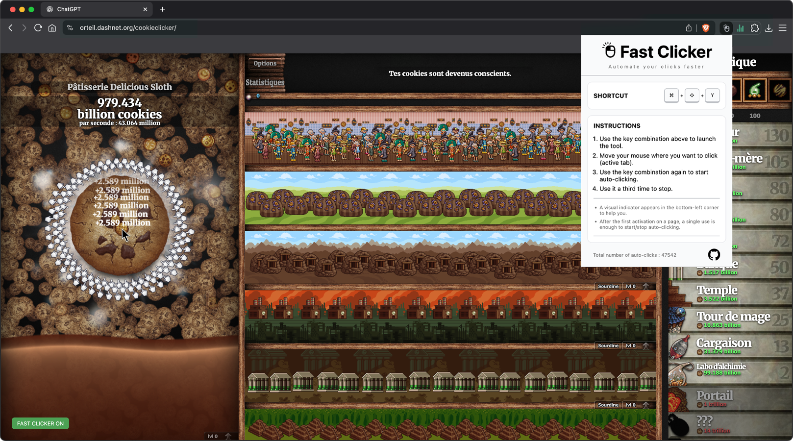

# Fast Clicker

## Description

Fast Clicker is a minimal and lightweight Chrome extension that lets you automate clicks directly in your browser using a simple keyboard shortcut.

The idea came after some friends introduced me to Cookie Clicker. I tried a few existing autoclickers to avoid destroying my trackpad, but none of them really matched what I wanted: something simple, clean, browser-based, and distraction-free. So I decided to build my own.

Fast Clicker lets you start and stop automatic clicking from the active tab, displays a small visual indicator on the page, and keeps track of the total number of auto-clicks.


## Objectives

- Trigger auto-clicking with a keyboard shortcut.
- Click automatically at the current mouse position.
- Display a visual indicator directly on the active page.
- Count the total number of auto-clicks.
- Persist click data across browser sessions.
- Keep the extension minimal, fast, and easy to understand.

## Tech Stack


## File Description

| **FILE**        | **DESCRIPTION**                                                          |
| :-------------: | ------------------------------------------------------------------------ |
| `assets`        | Contains the resources required for the repository.                      |
| `manifest.json` | Chrome manifest file (V3) that declares extension metadata.              |
| `background.js` | Background service worker that manages the shortcut and click counter.   |
| `popup`         | Contains the popup interface: `popup.html`, `popup.css`, and `popup.js`. |
| `scripts`       | Placeholder for extra logic or utility functions.                        |
| `images`        | Folder containing icons or UI images.                                    |
| `README.md`     | The README file you are currently reading 😉.                            |

## Installation & Usage

### Installation

1. Clone this repository:
    - Open your preferred Terminal.
    - Navigate to the directory where you want to clone the repository.
    - Run the following command:

```
git clone https://github.com/fchavonet/chrome_extension-fast_clicker.git
```

2. Open a Chromium-based browser (Brave, Edge, Google Chrome...) and navigate to:

```
chrome://extensions/
```

3. Enable Developer Mode (top-right corner).

4. Click on "Load unpacked" and select the project folder.

5. The extension should now appear in your extensions menu.

> You can pin it to your browser toolbar via your extensions menu.

### Usage

1. Open any web page where you want to use Fast Clicker.

2. Use the keyboard shortcut once to initialize the tool.

3. Move your mouse where you want to click.

4. Use the shortcut again to start auto-clicking.

5. Use the shortcut again to stop auto-clicking.

6. Open the extension popup to view the total number of auto-clicks.

> The total click count is stored locally in your browser with `chrome.storage.local`.



## What's Next?

- Add a speed selector in the popup.
- Add a reset button for the total click counter.
- Improve the visual indicator displayed on web pages.
- Add optional per-site settings.
- Explore Firefox support.

## Thanks

- A big thank you to my friends Pierre and Yoann who introduced me to Cookie Clicker and gave me the perfect excuse to build this extension.

## Author(s)

**Fabien CHAVONET**
- GitHub: [@fchavonet](https://github.com/fchavonet)
